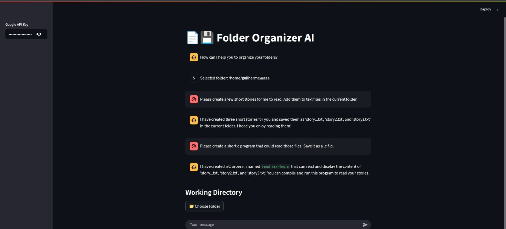

# File Management / Folder Organizer Assistant



The implemented AI agent is meant to help with tasks involving creating / generating, locating, analyzing and reorganizing folders and files.

## 🛠️ Setup Instructions

1. Clone the repository to a folder of your choice.
```
git clone https://github.com/guirque/C-thulhu.git <folder>
```

2. Create a .env file with your Gemini API key in the project folder:
Inside the .env file:
```
GEMINI_API_KEY=<your_key>
```

3. In the chosen folder, create a python virtual environment.
```
python -m venv venv
```

4. Initiate the environment.  
  
  Windows:
  ```
  .\venv\Scripts\activate
  ```
  Linux:
  ```
  source venv/bin/activate
  ```

5. Install pip dependencies
```
pip install -r requirements.txt
```

6. If not present, install Tkinter

  Ubuntu example:
  ```
    sudo apt install python3-tk
  ```

  You're all set! Just run the app whenever desired.

## 💼 Dependencies

The project pip dependencies are listed in the requirements.txt file. They include:
- LangChain
- Streamlit
- Dotenv
- EasyGUI

There is also Tkinter, installed separately.

## 🏃 Run the Agent!

While in the environment and on the project folder, run:
```
streamlit run src/view/index.py
```

This will instantly open the web app in a browser.  
You may then chat with it accordingly.